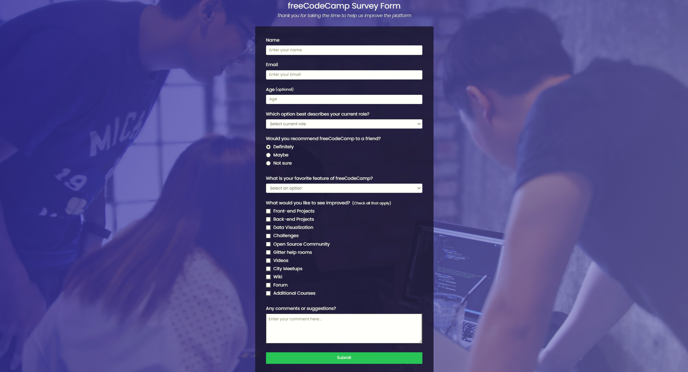

# 💎 Responsive freeCodeCamp Survey Form

## [Watch it on youtube](https://youtu.be/ZpfdO3LRrjU)

- Responsive freeCodeCamp Website Design Using HTML & CSS
- Developed first with the Mobile First methodology, then for desktop.
- Compatible with all mobile devices and with a beautiful and pleasant user interface.

💙 Join the channel to see more videos like this. [WebCode](https://www.youtube.com/channel/UCfPJ07vvW4CBs6M-vn4ctMQ)

